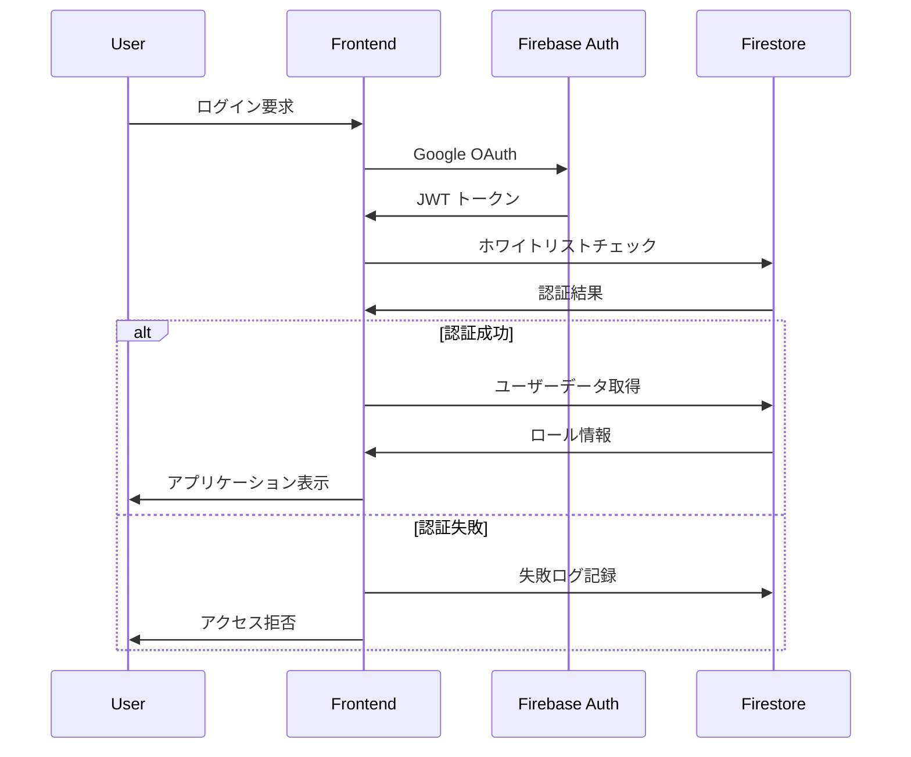

# 🏗️ 技術アーキテクチャ詳細

## 📐 **システム構成図**

```mermaid
graph TB
    subgraph "Frontend (React + TypeScript)"
        A[App.tsx] --> B[AuthProvider]
        A --> C[ThemeProvider]
        A --> D[UsersProvider]
        
        B --> E[Login.tsx]
        B --> F[HamburgerMenu.tsx]
        
        D --> G[MembersPage.tsx]
        D --> H[RegisterUserPage.tsx]
        
        C --> I[DeveloperDashboard.tsx]
        C --> J[ロールベーステーマ]
        
        subgraph "Core Features"
            K[ThreadsList.tsx]
            L[NotesList.tsx]
            M[ProfileSettings.tsx]
        end
        
        subgraph "Monitoring"
            N[ErrorBadge.tsx]
            O[LoginHistory.tsx]
            P[SessionManager]
        end
    end
    
    subgraph "Backend (Firebase)"
        Q[Authentication]
        R[Firestore]
        S[Storage]
        T[Security Rules]
        
        subgraph "Collections"
            U[users]
            V[threads]
            W[notes]
            X[Whitelist]
            Y[accessAttempts]
            Z[sessions]
        end
    end
    
    A --> Q
    K --> R
    L --> R
    R --> U
    R --> V
    R --> W
    Q --> X
    Q --> Y
    P --> Z
```



## 🔧 **技術スタック詳細**

### **Frontend Technologies**
```json
{
  "core": {
    "React": "18.x - UI ライブラリ",
    "TypeScript": "5.x - 型安全性",
    "Vite": "最新 - 高速ビルドツール"
  },
  "state_management": {
    "React Context": "認証・ユーザー・テーマ状態",
    "Zustand": "エラーログ状態管理",
    "useState/useEffect": "コンポーネントレベル状態"
  },
  "styling": {
    "Tailwind CSS": "ユーティリティファースト",
    "Headless UI": "アクセシブルなUI コンポーネント",
    "Heroicons": "一貫したアイコンセット"
  },
  "routing": {
    "React Router": "SPA ルーティング",
    "Protected Routes": "認証ベースアクセス制御"
  }
}
```

### **Backend & Infrastructure**
```json
{
  "database": {
    "Firestore": "NoSQL リアルタイムDB",
    "Collections": "users, threads, notes, Whitelist, accessAttempts, sessions",
    "Indexes": "効率的なクエリのための複合インデックス"
  },
  "authentication": {
    "Firebase Auth": "Google OAuth 2.0",
    "Custom Claims": "ロールベース認証",
    "Security Rules": "サーバーサイド認証"
  },
  "security": {
    "Firestore Rules": "データアクセス制御",
    "CORS": "オリジン制限",
    "Input Validation": "XSS/SQLi 防止"
  }
}
```

## 🔐 **セキュリティ実装詳細**

### **多層防御システム**
```typescript
// 1. フロントエンド認証チェック
if (!userData || !isAuthorized) {
  return <Login />;
}

// 2. ルートレベル保護
<Route element={
  userData.role === 'developer' ? 
  <DeveloperDashboard /> : 
  <Navigate to="/" replace />
} />

// 3. Firestore ルール
allow read, write: if 
  isAuthenticated() && 
  isUserProfessorOrDeveloper() && 
  resource.data.createdBy == request.auth.token.email;
```

### **データ検証フロー**


## 📊 **パフォーマンス最適化**

### **React レベル最適化**
```typescript
// 1. コンポーネントメモ化
export default memo(DeveloperDashboard);

// 2. 関数メモ化
const fetchStats = useCallback(async () => {
  // 重い処理
}, [dependencies]);

// 3. 値メモ化  
const themeColors = useMemo(() => 
  getThemeColors(), [currentTheme]
);

// 4. 条件付きレンダリング
{userRole === 'developer' && <DeveloperDashboard />}
```

### **Firebase 最適化**
```typescript
// 1. クエリ最適化
const q = query(
  collection(db, 'threads'),
  orderBy('createdAt', 'desc'),
  limit(10) // ページネーション準備
);

// 2. リアルタイムリスナー管理
useEffect(() => {
  const unsubscribe = onSnapshot(q, callback);
  return () => unsubscribe(); // メモリリーク防止
}, []);

// 3. バッチ処理
const batch = writeBatch(db);
batch.set(ref1, data1);
batch.set(ref2, data2);
await batch.commit();
```

## 🔄 **状態管理アーキテクチャ**

### **Context 階層構造**
```typescript
// 1. AuthContext - 最上位
interface AuthContextType {
  user: User | null;
  userData: UserData | null;
  isAuthorized: boolean;
  signIn/signOut: Functions;
}

// 2. UsersContext - ユーザー管理
interface UsersContextType {
  users: UserData[];
  getDisplayName: (email: string) => string;
  refreshUsers: () => Promise<void>;
}

// 3. ThemeContext - UI状態
interface ThemeContextType {
  currentTheme: RoleTheme;
  setCurrentTheme: (theme: RoleTheme) => void;
  themeColors: ThemeColors;
}

// 4. ErrorLog (Zustand) - グローバル状態
interface ErrorStore {
  errors: ErrorLog[];
  unreadCount: number;
  logError: (error: Error, location?: string) => void;
}
```

## 📱 **レスポンシブデザイン実装**

### **ブレークポイント戦略**
```css
/* Tailwind CSS クラス使用例 */
.responsive-grid {
  @apply grid grid-cols-1 md:grid-cols-2 lg:grid-cols-4 gap-6;
}

.responsive-text {
  @apply text-sm sm:text-base lg:text-lg;
}

.mobile-menu {
  @apply block md:hidden;
}
```

### **デバイス対応**
- **📱 Mobile**: 320px-768px (縦スクロール重視)
- **📊 Tablet**: 768px-1024px (2カラムレイアウト)  
- **💻 Desktop**: 1024px+ (マルチカラムレイアウト)

## 🧪 **テスト戦略 (実装準備)**

### **テストピラミッド**
```typescript
// 1. Unit Tests (将来実装)
describe('ThemeContext', () => {
  test('should return correct theme colors', () => {
    // テストケース
  });
});

// 2. Integration Tests
describe('Authentication Flow', () => {
  test('should allow access for whitelisted users', () => {
    // 統合テスト
  });
});

// 3. E2E Tests
describe('User Journey', () => {
  test('should create and edit memo successfully', () => {
    // エンドツーエンドテスト
  });
});
```

## 🚀 **デプロイメント戦略**

### **環境分離**
```bash
# 開発環境
VITE_FIREBASE_PROJECT_ID=memo-app-dev

# ステージング環境  
VITE_FIREBASE_PROJECT_ID=memo-app-staging

# 本番環境
VITE_FIREBASE_PROJECT_ID=memo-app-prod
```

### **CI/CD パイプライン (計画)**
```yaml
# .github/workflows/deploy.yml
name: Deploy
on:
  push:
    branches: [main]
jobs:
  deploy:
    runs-on: ubuntu-latest
    steps:
      - uses: actions/checkout@v2
      - name: Setup Node
      - name: Install dependencies  
      - name: Build
      - name: Deploy to Firebase
```

## 📈 **監視・ログ戦略**

### **リアルタイム監視**
```typescript
// 1. エラー監視
const { logError } = useErrorLog();
logError(new Error('処理失敗'), 'ComponentName.function');

// 2. パフォーマンス監視
const startTime = performance.now();
// 処理実行
const endTime = performance.now();
console.log(`処理時間: ${endTime - startTime}ms`);

// 3. ユーザー行動監視
const { logUserAction } = useAnalytics();
logUserAction('memo_created', { threadId, noteId });
```

この技術アーキテクチャにより、スケーラブルで保守性の高いアプリケーションを実現しています！
